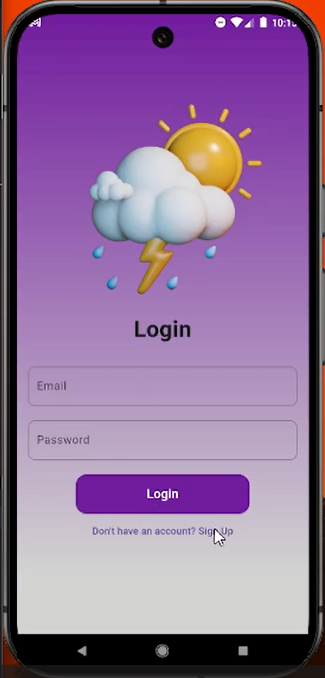
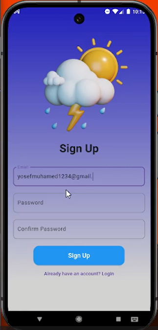
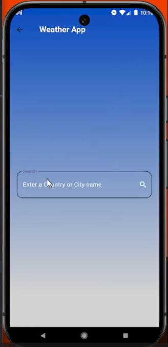
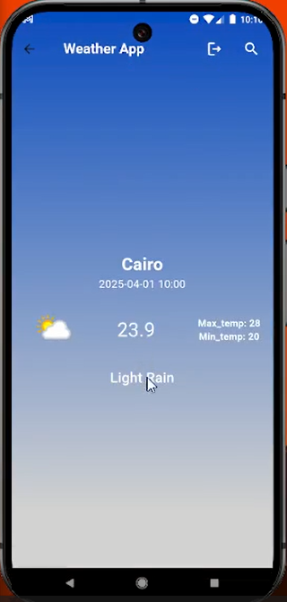

# Weather App

## 📱 Overview

Weather App is a feature-rich mobile application built with Flutter that provides real-time weather information for cities worldwide. Users can create accounts, save favorite locations, and access detailed weather forecasts including temperature, humidity, wind speed, and more.

## ✨ Features

- **User Authentication**
  - Email/password sign-up and sign-in
  - Secure authentication via Firebase

- **Weather Information**
  - Real-time weather data
  - Detailed forecasts including temperature, humidity, and wind speed
  - Search for any city globally
  - Location-based weather detection
   

## 🛠️ Tech Stack

- **Flutter** - UI framework
- **Dart** - Programming language
- **Firebase** - Authentication and backend services
- **Cubit/Bloc** - State management
- **Weather API** - Data source for weather information


## 🚀 Installation & Setup

### Prerequisites

- Flutter SDK (latest version)
- Android Studio / Xcode
- Firebase account
- Weather API key (from [weatherapi.com](https://www.weatherapi.com/) or similar)

### Setup Instructions

1. **Clone the repository**

```bash
git clone https://github.com/yosefmuhamed-github/eyego-weather-app
cd eyego_weather_app
```

2. **Install dependencies**

```bash
flutter pub get
```

3. **Firebase Configuration**

- Create a new project in [Firebase Console](https://console.firebase.google.com/)
- Enable Authentication (Email/Password)
- Download `google-services.json` (Android) and/or `GoogleService-Info.plist` (iOS)
- Place these files in the appropriate directories:
  - Android: `android/app/`
  - iOS: `ios/Runner/`


4. **Run the app**

```bash
flutter run
```

## 📖 How to Use

### Authentication

1. Launch the app and navigate to the sign-up screen
2. Create an account using email and password
3. Log in with your credentials

### Weather Features

**Search for a City**
   - Tap on the search icon
   - Enter city name
   - View detailed weather information


## 📷 Screenshots

<div align="center">
  
  
  
  
</div>

## 🔮 Future Enhancements

- **Extended Forecast**: 7-day and hourly forecasts
- **Weather Alerts**: Push notifications for severe weather
- **Social Sharing**: Share weather information with friends
- **Weather Maps**: Interactive maps showing precipitation, temperature, etc.
- **Multiple Themes**: More UI customization options
- **Google/Apple Sign-In**: Additional authentication methods

## 👥 Contributors

- Yosef Muhamed - Project Lead - [GitHub](https://github.com/yosefmuhamed-github/eyego-weather-app)

## 📩 Contact

For questions, suggestions, or contributions, please reach out to:

- Email: yosefmuhamed37729499@gmail.com
